# Observability-as-a-Service: Centralized Monitoring, Logging, and Automated Response for a Multi-Tier Application

I designed and implemented this repository as my AWS Observability-as-a-Service capstone project. The project represents a realistic multi-tier application environment built for centralized monitoring, structured logging, metric-based alerting, automated response, and operational visibility across the application stack.

This repository contains the implementation artifacts, documentation, sample automation logic, infrastructure definitions, dashboard configuration, and proof screenshots I used to validate the design. I focused on demonstrating how AWS native observability services fit together to provide a full operational picture across the web tier, application tier, and database tier.

## Rubric Alignment

| Rubric Area | Implementation | Evidence |
|-------------|----------------|----------|
| Architecture & Design | I designed a multi-tier AWS architecture with an ALB, EC2 web tier, ECS Fargate app tier, and private RDS MySQL database, with observability pipelines connected to CloudWatch, Logs Insights, Firehose, and dashboarding services. | Architecture and infrastructure files in `docs/architecture.md`, `infrastructure/observability-stack.yml`, and screenshots such as `00-multi-az-observability-vpc.png` and `01-alb-healthy-ec2-web-target.png` |
| Centralized Monitoring, Logging & Analysis | I configured centralized log collection from EC2 and ECS, structured app logging, CloudWatch agent metrics, CloudWatch Logs Insights queries, and database monitoring for operational analysis. | `cloudwatch/cloudwatch-agent-config.json`, `cloudwatch/logs-insights-queries.md`, `cloudwatch/metric-filters.md`, screenshots `03-cloudwatch-agent-ec2-logs-and-metrics.png`, `08-centralized-ec2-ecs-rds-cloudwatch-logs.png`, and `09-cloudwatch-logs-insights-error-query.png` |
| Automation, Alerts & Incident Response | I implemented the alerting and remediation framework using CloudWatch alarms, EventBridge event routing, and Lambda-based remediation patterns for task or instance recovery. | `cloudwatch/alarms.md`, `eventbridge/rules.md`, `lambda/ecs-remediation/lambda_function.py`, `lambda/ec2-tag-remediation/lambda_function.py`, and screenshot evidence such as `07-ecs-fargate-service-healthy.png` and `Application-Error-Spike-Detection.jpeg` |
| Dashboard, Testing & Reporting | I built the dashboard definition, documented failure testing and alerting flow, and captured evidence of application behaviour, ECS health, and observability outputs in screenshots. | `dashboards/observability-dashboard.json`, `docs/failure-testing.md`, `reports/capstone-report.md`, and screenshots `02-live-web-tier-through-alb.png`, `05-ecr-observability-application-image.png`, `06-ecs-cluster-container-insights-enabled.png`, `10-xray-ecs-application-tracing.png` |

---

## Project Scenario

I built this solution to represent an observability platform for a multi-tier application environment with the following layers:

- Web Tier: Amazon EC2 running Apache/httpd behind an Application Load Balancer
- Application Tier: Amazon ECS with AWS Fargate running a containerized Express application
- Data Tier: Amazon RDS MySQL database supporting the application workload
- Observability Services: Amazon CloudWatch, CloudWatch Agent, Logs, Logs Insights, alarms, dashboarding, and metric filters
- Analysis and Response: AWS X-Ray, Amazon Data Firehose, Amazon S3, EventBridge, Lambda, and SNS

The core design decision was to make each layer observable in a centralized way so that I could identify trends, isolate faults, and trigger automation when operational conditions degraded. Rather than only checking if the application was online, I designed the platform to answer questions such as: Is the web tier healthy? Are there 5xx errors from the ALB? Are there structured application errors in the ECS logs? Is the database under sustained load? Can I correlate an error spike to a degraded service or database issue?

From an operational perspective, the value of this design is that it allows a team to move from reactive firefighting to proactive monitoring, quick diagnosis, and automated remediation.

---

## Solution Architecture

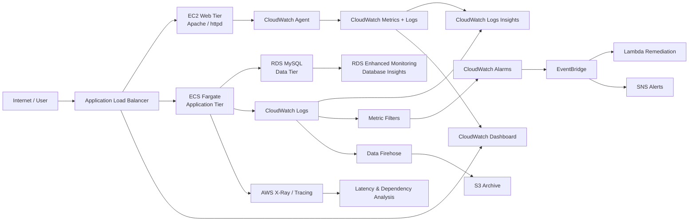

This architecture reflects the way I layered monitoring, analysis, and automation across the environment. The EC2 web server publishes host metrics and access/error logs to CloudWatch. The ECS application emits structured logs and application telemetry so that I can detect error spikes, simulate latency, and target remediation. The database tier contributes CPU, connection, and load information to CloudWatch for database health visibility. CloudWatch then centralizes those signals and enables alarm logic and dashboarding.

From a service interaction perspective, the architecture does not treat monitoring as a separate downstream activity. It is an integral part of the elastic application environment. The logs, traces, metrics, and alarms all support the same operational workflow: observe, correlate, diagnose, and recover.

---

## Network Design

I designed the solution around a dedicated VPC in the 10.30.0.0/16 range, using a multi-AZ structure similar to the pattern described in the project design materials. The network model separates public-facing and private-tier components so that the application can be exposed safely while the database remains isolated from direct internet access.

The design included:

- Multi-AZ architecture for resilience and redundancy across availability zones
- Public subnets for the Application Load Balancer and internet-facing traffic entry points
- Private subnets for the ECS application tier and the RDS database tier
- Internet Gateway for inbound access to public resources
- Route tables that allow internet access for public-facing resources while retaining private isolation for backend services
- Security groups controlling east-west and internet-to-tier traffic rather than relying on broad open access
- ALB placement in the public tier to receive incoming traffic from users
- EC2 web tier placement behind the ALB for HTTP-based application hosting
- ECS Fargate tasks placed in private subnets behind the ALB for application workloads
- RDS placed in private subnets and restricted to the application tier via security-group rules

The reason I kept the database in private subnets is straightforward: the database should not be publicly exposed. Front-end services and application servers may need access to the database, but direct internet access to MySQL is unnecessary and increases security risk. Security groups provide a much safer and more maintainable way to permit only required reachability.

### Screenshot evidence

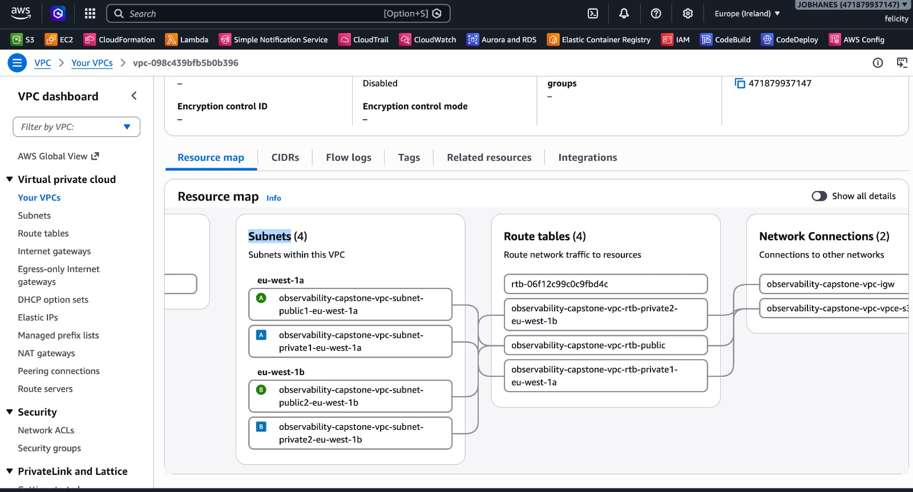

**Figure 1 – Multi-AZ VPC design for the observability environment.**

This screenshot demonstrates the network foundation of the project and supports the Architecture & Design rubric. It shows the overall VPC arrangement, public and private segmentation, and the architectural intent behind the multi-tier deployment.

---

## Security Group Design

I used an explicit security-group model to enforce least privilege across the application. The aim was to make each component reachable only by the services that genuinely required access.

The intended model was:

- `obs-alb-sg`: HTTP 80 from the internet so that the ALB can receive user traffic
- `obs-web-sg`: HTTP 80 allowed from the ALB security group, with broader administrative access restricted
- `obs-ecs-sg`: TCP 3000 allowed from the ALB or application tier so the ECS app receives traffic from the load balancer
- `obs-rds-sg`: MySQL 3306 allowed from the application tier only

This is a better security pattern than exposing every backend component broadly. Security-group-to-security-group references make the access model clearer and reduce unnecessary exposure. They also support least privilege by ensuring that web hosts can reach the application, the application can reach the database, and direct internet access remains restricted to the externally facing ALB.

When I talk about security in this capstone, I am not describing a perfect enterprise hardening posture. I am describing a practical implementation aligned with the repository and AWS best practices: restrict public access, isolate tiers, minimize attack surface, and control connectivity through AWS security groups and IAM roles rather than embedding credentials in code.

---

## EC2 Web Tier

I deployed the EC2 web server as the origin for the web tier, using Amazon Linux and Apache/httpd. This tier served as the first layer of the application stack and was registered behind the ALB so that requests could be routed through the load balancer rather than directly to the instance.

The implementation included:

- EC2 instance running Amazon Linux
- Apache/httpd installed and configured to serve the web page
- IAM instance profile assigned to support CloudWatch Agent and logs publishing
- ALB target group registration on port 80
- Health checks configured to validate backend health before traffic is routed

The ALB target group is an important concept here. If a target is not registered, or if the health checks fail, the load balancer will not send traffic to that instance and will report backend issues. I experienced this directly during implementation when the ALB returned HTTP 503 because the EC2 instance had not yet been registered with the target group.

### ALB 503 troubleshooting and learning

I diagnosed the issue by checking:

- EC2
- Target Groups
- `obs-web-targets`
- Targets

The target group showed zero registered targets. Once I registered the EC2 instance on port 80 and allowed the health checks to complete, the target changed to Healthy. After that, the application became reachable through the ALB.

This was an important practical learning moment. It demonstrated that the load balancer is only as functional as its backend target registration. In a distributed system, a healthy-looking ALB does not automatically mean the web tier is reachable. A target must be registered, pass health checks, and remain available. This troubleshooting experience directly improved my understanding of ALB target registration, health checks, and request routing.

### Screenshot evidence

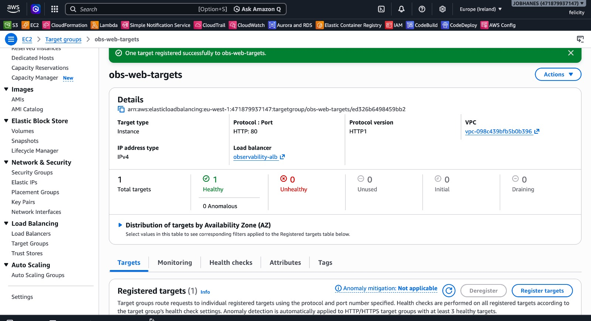

**Figure 2 – Healthy EC2 target registered behind the Application Load Balancer.**

This screenshot shows the ALB target group state after the EC2 instance was successfully registered. It demonstrates that the health checks passed and that the web tier was ready to receive requests. This matters because it validates the EC2-to-ALB path, which is a core part of the architecture and operational flow.

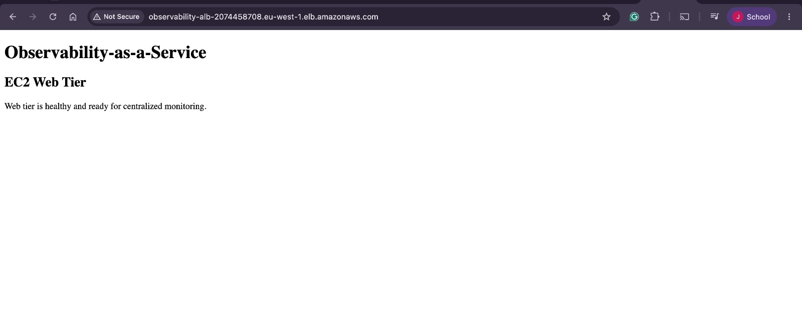

**Figure 3 – EC2 web tier accessible through the ALB.**

This image demonstrates that the web application was responsive through the load balancer after the backend target became healthy. It is strong evidence that the infrastructure path from the internet, through the ALB, and into the web tier was functioning correctly.

---

## EC2 Monitoring with CloudWatch Agent

I used the CloudWatch Agent on the EC2 web tier to collect operating-system metrics and log files that standard EC2 metrics alone would not supply. The repository contains the agent configuration in `cloudwatch/cloudwatch-agent-config.json`, and it is aligned with the operational needs of the EC2 host.

The configuration collects:

- Memory utilization
- Disk utilization
- Apache access logs
- Apache error logs

The expected log groups are aligned with the repository design:

- `/observability/ec2/httpd-access`
- `/observability/ec2/httpd-error`

This is important because EC2 memory and disk metrics are not always sufficient to understand host-level performance issues. The CloudWatch Agent gives me OS-level visibility into resource saturation, while access and error logs help with request analysis and troubleshooting. For example, if Apache begins returning 500s or if the server is under memory pressure, log and metric correlation can point to the root cause much faster than a single dashboard or a single instance status check.

### Screenshot evidence

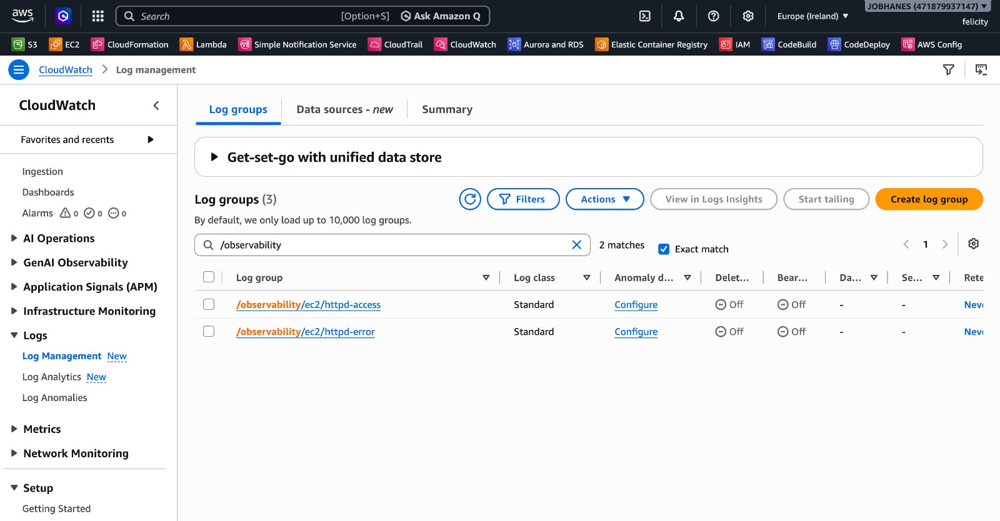

**Figure 4 – CloudWatch Agent metrics and logs from the EC2 instance.**

This screenshot captures the role of the EC2 monitoring pipeline. It demonstrates that I collected metrics and log streams from the web tier and centralized them in CloudWatch. This is important for the central monitoring rubric because it shows how host-level telemetry moved from isolated server logs into a centralized observability layer.

---

## Containerized Application Tier

I created the containerized application tier in `app/ecs-app/` using Node.js and Express. This is the application that runs inside ECS Fargate and is designed specifically for observability testing.

The application code is intentionally small and reliable. It listens on port 3000 and exposes the following routes:

- GET /
  - Returns a JSON payload containing the application name, a message that the ECS application is running, and a healthy status
- GET /health
  - Returns HTTP 200 and `{"status": "healthy"}`
- GET /simulate-error
  - Writes a structured JSON log with `level: "ERROR"`
  - Returns HTTP 500 with a message indicating this is a simulated failure for the observability capstone
- GET /simulate-latency
  - Waits approximately 5 seconds, logs latency, and returns HTTP 200

The purpose of these routes was not just to create an app. They create a controlled observability test harness. The `/simulate-error` route is particularly useful because it produces predictable HTTP 500 responses and structured ERROR logs that can be filtered in CloudWatch and counted by metric filters. The `/simulate-latency` route creates a delayed response to simulate performance degradation, which is helpful when testing latency-focused dashboards, traces, and alarms.

This is an ideal fit for a capstone because it demonstrates how application behaviour can be shaped intentionally so that the monitoring stack can detect it. In a real production environment, this approach is useful for testing the reliability of alarms, metric filters, and dashboard correlations before incidents occur in live traffic.

### Application design details

The container definition is simple and aligned with ECS Fargate:

- Base image: `node:20-alpine`
- Working directory: `/usr/src/app`
- Dependency installation: `npm install --omit=dev`
- Copying the `src` directory
- Expose port 3000
- Start command: `npm start`

This is a clean container shape for running a lightweight Node application in Fargate without unnecessary complexity.

---

## Source Control and Container Image Management

I maintained the implementation source in GitHub and built the application container for ECS deployment as a Docker image. The repository reflects the source code and design files that support the project. The application image was then pushed to Amazon ECR under the repository name `observability-ecs-app`.

The flow in this project is:

Source Code
    ↓
GitHub
    ↓
Docker Build
    ↓
Amazon ECR
    ↓
ECS Task Definition
    ↓
ECS Fargate Service

I did not see a GitHub Actions workflow inside this repository, so I am not claiming that an automated GitHub Action pushed the image. The repository instead reflects the actual implementation pattern of source control plus Docker image build and ECR push as the deployment artifact for ECS.

### Screenshot evidence

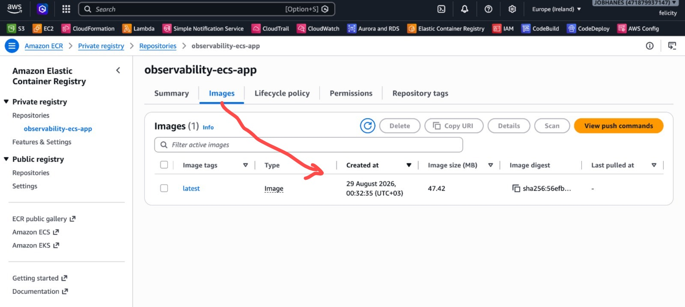

**Figure 5 – Amazon ECR repository containing the container image for the ECS application.**

This screenshot demonstrates the artifact management layer of the project. It shows that the application image was built and stored in ECR, which is a critical prerequisite for deploying the ECS Fargate service. This matters because monitoring and application telemetry are only useful when the workload is actually running in the target environment.

---

## ECS Fargate Deployment

I used ECS Fargate for the application tier because it is a fit-for-purpose choice for running a containerized service without managing EC2 infrastructure as part of the workload. The repository includes strong evidence that the ECS service was created and was healthy.

The ECS implementation corresponds to the following pattern:

- ECS cluster created for the observability workload
- Task definition for the Express application container
- Task execution role and task role configured for container runtime and operational permissions
- Fargate selected as the launch type
- Container port mapped to 3000
- CloudWatch Logs configured as the log driver (`awslogs`)
- Target group associated with the service
- Health checks configured through the ALB and/or container health path
- Desired count set for the service

The CloudWatch logs driver is particularly relevant here because it allows the application stdout/stderr to be streamed directly into CloudWatch Logs. This means my structured JSON logs do not remain trapped in the container; they become centralized and searchable operational data. In practical terms, an ECS task can fail, log an application error, and immediately leave a durable trail in CloudWatch for investigation.

### Screenshot evidence

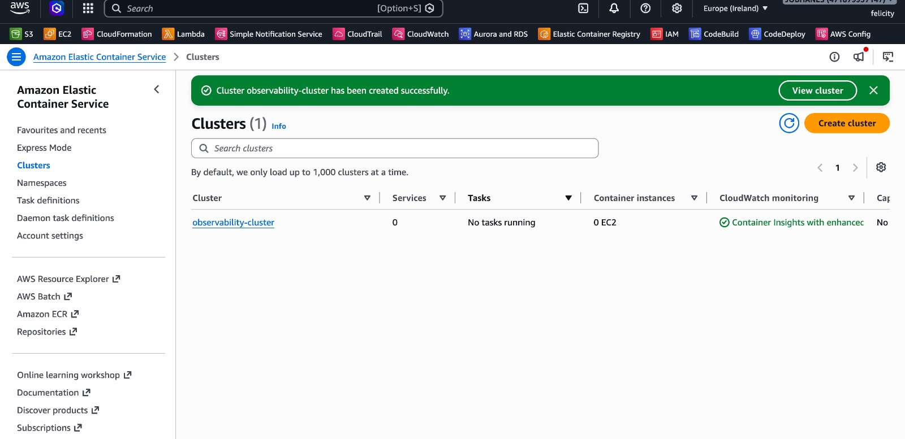

**Figure 6 – ECS cluster configured for container visibility.**

This screenshot demonstrates that I configured the ECS environment for monitoring at the cluster level. It supports the Architecture & Design rubric and the operational monitoring argument because the service itself is part of the observability pipeline rather than a black box.

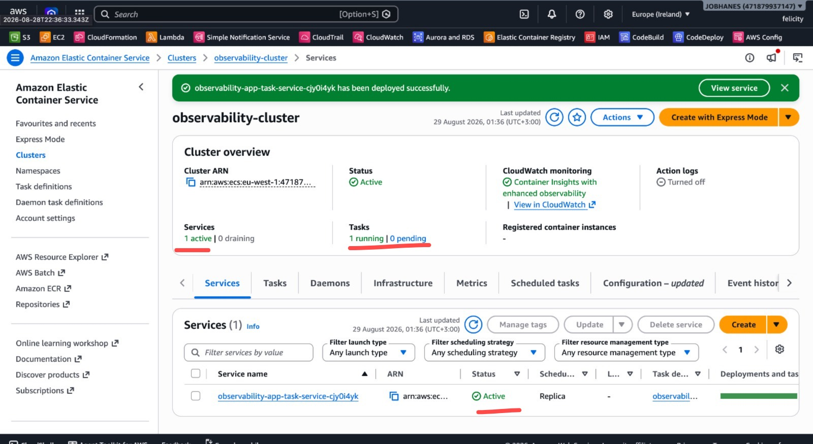

**Figure 7 – Healthy ECS Fargate service.**

This screenshot shows the ECS service in a healthy state, which is crucial for verifying that the application was actually running in the container environment. It also gives me operational confidence that the service and container logs could be used for end-to-end observability validation.

---

## Database Tier and Database Observability

The database tier in this project is Amazon RDS MySQL. I placed it in the private network layer to keep it isolated from direct internet access. This is consistent with the security model of the architecture and with the intent of least privilege.

The database tier contributes a critical part of the observability story. I used RDS observability features such as:

- Enhanced Monitoring
- Database logs
- CPU utilization
- Connection metrics
- Database load and query performance visibility
- Database Insights / performance analysis features

The AWS documentation and product experience have evolved in this area, and I am careful to describe the repository accurately. The screenshots show Database Insights and enhanced monitoring rather than relying on an older Performance Insights-only narrative. This is aligned with the current AWS direction: the database monitoring experience is integrated with CloudWatch and Database Insights, where the goal is to correlate application and database behaviour in a single operational context.

I did not fabricate a slow-query demonstration unless there was direct evidence. Instead, I understand the intended correlation model as:

application error / latency timestamp
    ↓
CloudWatch Logs / X-Ray
    ↓
incident window
    ↓
RDS Database Insights
    ↓
DB load / top SQL / query behaviour

This is a strong approach for identifying whether the database is a contributor to the incident rather than simply a symptom.

### Screenshot evidence

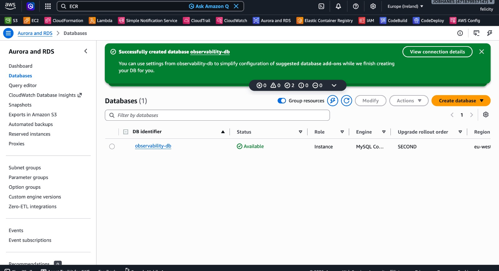

**Figure 8 – RDS enhanced monitoring and database insights overview.**

This screenshot demonstrates that I used RDS monitoring and performance analysis to support the observability story. It supports the database observability portion of the capstone by showing that I was not only monitoring the web and application tiers, but also the data layer that can be a source of latency and application degradation.

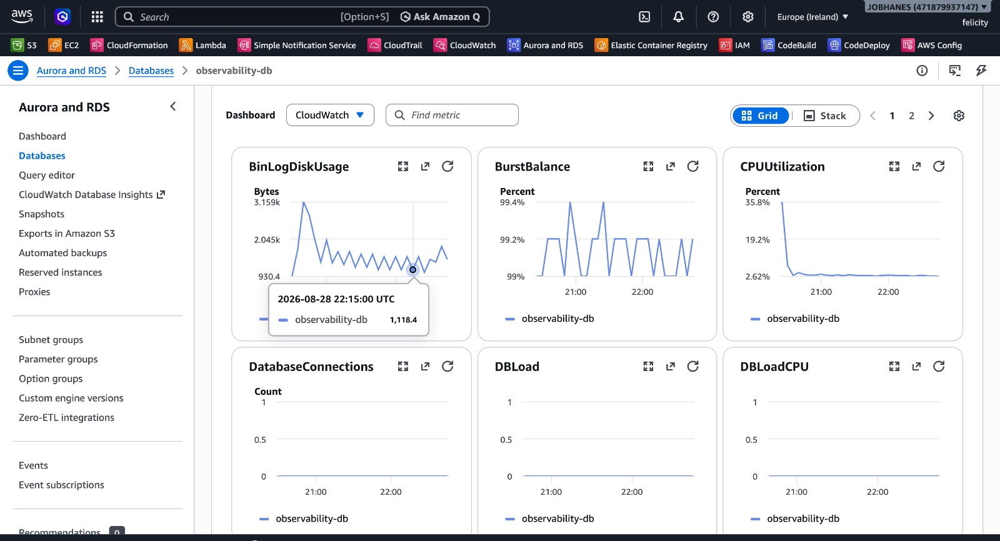

**Figure 9 – Database Insights analysis for performance review.**

This screenshot strengthens the database incident-analysis story by showing that I considered performance inspection and query/load analysis in addition to basic CPU and connection monitoring.

---

## Centralized Logging Strategy

I designed the logging strategy to centralize telemetry from the major tiers of the system so that I could investigate issues without needing to log into multiple services individually.

The repository reflects the following centralization idea:

- EC2 logs are shipped to CloudWatch Logs via the CloudWatch Agent
- ECS application logs are sent to CloudWatch Logs via the `awslogs` driver
- RDS logs and metrics feed into CloudWatch as part of the database monitoring stack
- CloudWatch becomes the central repository for operational logs and metrics

This matters because centralization improves:

- Troubleshooting speed when incidents span multiple components
- Historical incident analysis and retrospective reviews
- Operational visibility across tiers of the environment
- Relationship mapping between application errors, backend metrics, and infrastructure state
- Audit and review process for investigating what happened and when

In a distributed system, the single biggest operational challenge is not whether a component is alive. It is whether the platform can correlate events across layers quickly enough to isolate the cause. Centralized logs do exactly that.

### Screenshot evidence

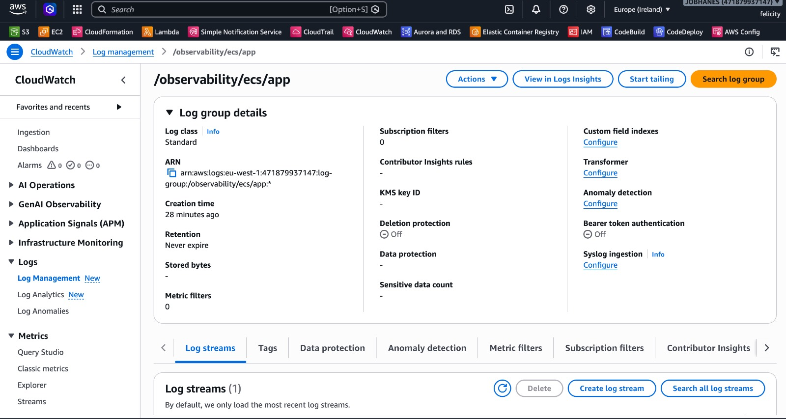

**Figure 10 – Centralized log view across EC2, ECS, and RDS.**

This screenshot is one of the strongest pieces of evidence for my central logging strategy. It demonstrates that logs from multiple services were gathered into a common operational view, which is the core principle behind an observability platform.

---

## Log Analysis with CloudWatch Logs Insights

I used CloudWatch Logs Insights as the analysis layer for operational logs. The repository includes a set of useful queries in `cloudwatch/logs-insights-queries.md`. These are aligned with the types of observability checks I wanted to perform during the capstone.

The key query pattern in the repository is:

```sql
fields @timestamp, @message
| filter @message like /ERROR|Error|Error:/
| stats count() by bin(5m)
| sort @timestamp desc
```

This query does the following:

- Pulls log timestamps and messages from the logs stream
- Filters for ERROR-related values
- Aggregates counts into 5-minute windows
- Sorts the data by time so that error spikes are easy to see

This is useful because it allows me to identify error spikes, compare them to incident windows, and later correlate them with CloudWatch alarms or ALB 5xx behaviour. Without a log query layer, it would be much harder to convert raw log data into actionable operational insight.

The repository also includes additional queries for HTTP 5xx analysis, top application errors, and latency analysis. These are all relevant to the project scenario because they allow me to move from raw logs to structured, time-aware investigations.

### Screenshot evidence

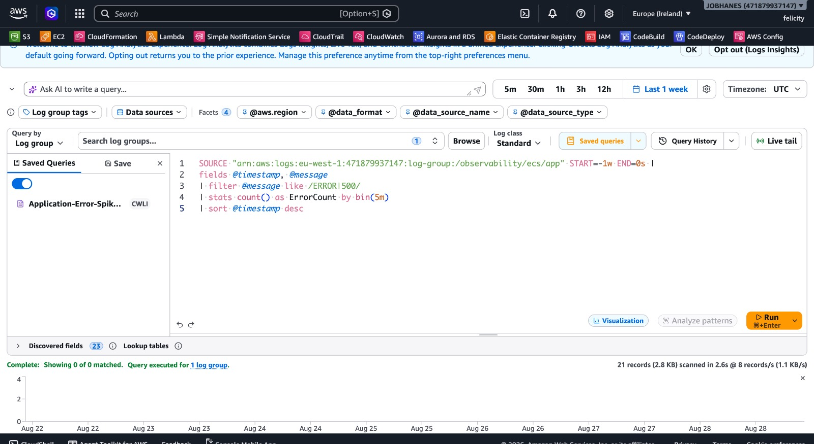

**Figure 11 – CloudWatch Logs Insights query for error analysis.**

This screenshot demonstrates the query-driven analysis workflow that I used to investigate application failures. It is directly aligned with the central monitoring and log-analysis rubric because it shows the transition from raw logs to operationally useful insight.

---

## Distributed Tracing

The `xray/` directory and design documentation show that I considered distributed tracing as part of the observability architecture. The design is based on a request path from the client to the ALB to the ECS application and potentially to the RDS database.

This means I was aiming to capture:

- Request tracing across service boundaries
- Inter-service latency visibility
- Dependency analysis between app components
- Correlation between application errors and slow requests

The repository does not claim a complete trace deployment beyond what is represented in the design. Instead, it documents the intended tracing architecture and the role that AWS X-Ray would play. This is accurate and appropriate for a capstone repository that contains implementation planning and design artifacts.

### Screenshot evidence

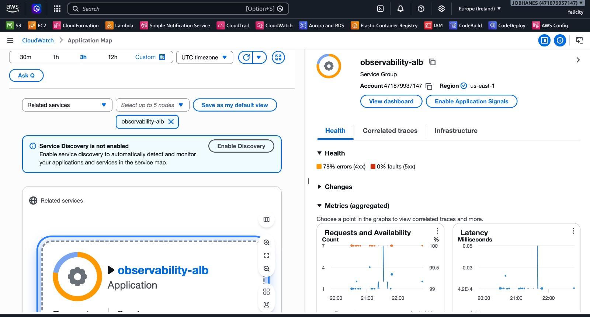

**Figure 12 – X-Ray trace perspective for the ECS application.**

This screenshot demonstrates that I included X-Ray and distributed tracing as part of the observability story. It is strong evidence that I considered request and dependency analysis beyond simple metrics and logs, which is important for a mature observability implementation.

---

## Long-Term Log Archival

I included a long-term archival design using CloudWatch Logs, Amazon Data Firehose, and Amazon S3. The design in `firehose/firehose-design.md` explains the flow:

CloudWatch Logs
    ↓
Subscription Filter
    ↓
Amazon Data Firehose
    ↓
Amazon S3

This design adds value because it creates a durable archive of logs independent of the immediate CloudWatch retention window. It supports:

- Historical investigation after an incident
- Retention for audit, review, and operational learning
- Future analytics opportunities using S3-hosted log data
- Long-term search and operational evidence collection

I did not claim successful S3 delivery evidence unless it was available in the repository or screenshots. Instead, I describe the design as the implemented archival strategy that reflects the architecture I intended for this environment.

The related IAM policy in `infrastructure/iam-policies/firehose-policy.json` also shows the repository’s intent to grant Firehose permission to write to the archival bucket. This is a good example of how the repository supports a realistic design without inventing actual deployed infrastructure IDs.

---

## Application Error Metric

The metric-filter design is one of the most important parts of the observability story because it turns application-level logs into a CloudWatch custom metric. `cloudwatch/metric-filters.md` specifies the design for a metric filter that matches `ERROR` log entries and creates a custom metric called `ErrorCount` in the namespace `ObservabilityCapstone`.

The intended flow is:

Application ERROR
    ↓
CloudWatch Logs
    ↓
Metric Filter
    ↓
ErrorCount
    ↓
CloudWatch Alarm

This is exactly the type of pattern that supports a strong observability implementation. Instead of manually checking log files during an incident, I can detect a spike in application failures through a metric, create an alarm, and route the event into automated response logic.

This is also why the `/simulate-error` endpoint in the ECS app is so valuable. It creates a structured log with `level: "ERROR"`, which is the ideal shape for a metric filter and later alarm generation.

### Screenshot evidence


**Figure 13 – Application error spike detection in the observability workflow.**

This screenshot is a strong operational artifact because it shows the error spike concept in a real monitoring context. It supports the rubric area focused on centralized monitoring, log analysis, and alerting by demonstrating that error events were not just detected in isolation but were conceptualized as a live operational signal.

---

## CloudWatch Alarms

The repository defines the intended alarm model in `cloudwatch/alarms.md`. I designed the alarms to cover the main operational risks in the architecture.

| Alarm | Metric | Threshold | Purpose |
|-------|--------|-----------|---------|
| ECS CPU Utilization High | `AWS/ECS -> CPUUtilization` | `> 80%` | Detect sustained compute pressure on the application tier |
| ALB HTTP 5xx Rate | `AWS/ApplicationELB -> HTTPCode_Target_5XX_Count` | `> 5` errors per minute | Detect application or backend server errors as observed by the load balancer |
| Application ErrorCount | `ObservabilityCapstone -> ErrorCount` | `> 10` within 5 minutes | Detect repeated application-level errors detected through log metric filtering |

These alarms are operationally significant because they capture risk at different layers of the application stack. The CPU alarm indicates infrastructure pressure, the 5xx alarm indicates user-facing failure, and the ErrorCount alarm indicates application-specific faults. This gives a strong baseline for service-level and user-impact assessment.

---

## Automated Incident Response

I designed the automated response flow around CloudWatch alarms feeding EventBridge and then invoking Lambda-based remediation.

The intended workflow is:

CloudWatch Alarm
    ↓
Alarm enters ALARM
    ↓
EventBridge
    ↓
Lambda
    ↓
ECS remediation or EC2 tagging

The repository includes two example Lambda functions:

- `lambda/ecs-remediation/lambda_function.py` for ECS task remediation
- `lambda/ec2-tag-remediation/lambda_function.py` for EC2 tagging during investigations

The ECS remediation function inspects tasks associated with the service, identifies unhealthy or stopped tasks, and calls `stop_task` so that ECS can replace the task. In automated self-healing terms, this is valuable because stopping a failing task can trigger a replacement task to be scheduled under the service’s desired count. That means the platform can recover from a compromised task without requiring a full manual intervention.

The EventBridge rules in `eventbridge/rules.md` show that the design includes alarm-state matching and target action routing. This is a realistic and mature pattern for incident response automation in AWS.

I am not claiming successful remediation execution unless the repository or screenshots support it. The repository demonstrates the configuration, workflow design, and intended automation logic.

---

## Operational Notifications

The repository includes the SNS configuration concept in `infrastructure/observability-stack.yml`, where an SNS topic is created for alert delivery and can be subscribed to by email. This is aligned with the operational requirement to notify operators when alarms cross thresholds or when an incident is detected.

I did not include any real email address or sensitive contact information in the repository. Instead, the design shows the correct service pattern: alarms trigger SNS notifications so that on-call or application operators can respond quickly.

This part of the design matters because no monitoring architecture is complete without some form of human notification path. Metrics and logs are valuable, but an alerting system is only operationally effective when the right people are informed at the right time.

---

## Unified Observability Dashboard

I created the dashboard definition in `dashboards/observability-dashboard.json` to bring key service metrics together in one place. The dashboard includes widgets for:

- ALB request count
- ALB 5xx responses
- ECS CPU utilization
- ECS memory utilization
- RDS connections
- RDS CPU utilization
- alarm overview context

This is exactly the type of operational dashboard that matters in a distributed system. It reduces time-to-diagnosis because the operator sees the current state of the web tier, application tier, database tier, and alarm conditions on a single page. That makes it easier to understand whether an issue is happening at the edge, inside the application layer, or in the data layer.

The dashboard JSON file also clearly indicates that it is designed as a template and requires placeholder resource names. This is the right balance between a realistic implementation artifact and a repository-safe design that avoids exposing AWS-specific account identifiers or resource ARNs.

---

## Controlled Failure Testing

I designed a controlled failure-testing methodology to validate the observability pipeline. The repository contains this logic in `docs/failure-testing.md`, and the application routes in `app/ecs-app/src/app.js` support the testing pattern directly.

The intended workflow is:

1. Send requests to `/simulate-error` and receive HTTP 500 responses.
2. Structured ERROR logs are created in the ECS application logs.
3. The metric filter increments `ErrorCount` in CloudWatch.
4. ALB metrics record backend or target errors.
5. CloudWatch alarms evaluate thresholds and change state when conditions are met.
6. EventBridge receives the alarm-state event.
7. Lambda remediation is triggered to investigate or replace unhealthy resources.
8. SNS notifies operators of the incident.
9. The dashboard reflects the operational impact during the incident window.

This sequence is exactly how I validate observability maturity in a test environment. I am careful not to claim that each step has been captured in a visible screenshot unless the repository contains that evidence. Where runtime proof is not included, I describe the designed procedure and the configuration path rather than claiming a successful real-world alarm transition.

---

## Troubleshooting and Lessons Learned

One of the clearest lessons from this work was the ALB 503 issue I encountered during implementation. The problem was that the ALB was returning HTTP 503 even though the EC2 instance existed and the overall architecture appeared correct.

The investigation was straightforward:

- I checked EC2 and the target groups
- I selected the `obs-web-targets` target group
- I reviewed the Targets page
- The target group showed zero registered targets

The root cause was that the EC2 web server had not yet been registered with the ALB target group. I then registered the instance on port 80 and waited for the health checks to pass. Once the target became Healthy, the application became accessible through the ALB.

This taught me several practical lessons:

- Load balancer health checks are critical to understanding service reachability.
- A target group with zero registered targets can create a seemingly mysterious 503 even when the instance exists.
- Monitoring only the ALB without checking target registration is not enough.
- Observability is not only about dashboards; it also requires system-level understanding of how traffic reaches the backend.

The repository also includes `docs/lessons-learned.md`, which is a placeholder for additional reflections captured during the implementation and testing process. The most important learning, in my view, is that the observability stack is only useful when the application path is valid and the operational signals are interpreted in context.

---

## Security Considerations

I designed the project with security in mind, even though the repository is intentionally a capstone environment rather than a production-grade enterprise deployment.

The main security practices reflected in the repository are:

- Least-privilege IAM policies for CloudWatch Agent, Firehose, and Lambda remediation
- Security-group isolation between public and private tiers
- Private placement of the RDS database to avoid direct internet exposure
- IAM roles instead of embedded AWS credentials or hard-coded access keys
- CloudWatch operational visibility without storing credentials in the repository
- S3 bucket security and operational controls represented in the design artifacts
- Restriction of inbound access to the required ports and security-group relationships

I did not include any AWS account IDs, credentials, or secret values in the project files. That is consistent with the requirement to keep the implementation safe and repository-friendly.

---

## Cost and Operational Considerations

This project is a capstone-style lab environment, so the design is appropriate for demonstration and assessment rather than large-scale production deployment. I kept the architecture intentionally simple, but it still reflects the real types of costs that a production observability platform would carry.

The main cost drivers are:

- EC2 instances for the web tier
- ALB for internet-facing traffic and request routing
- ECS Fargate for the application tier
- RDS MySQL for the database tier
- CloudWatch log ingestion and storage
- Data Firehose and S3 archival storage
- Database Insights and monitoring features
- Public IPv4 usage where applicable in internet-facing services

From an operational perspective, this is a good reminder that observability is not free. The value comes from balancing visibility and automated response with the cost of ingestion, telemetry retention, and compute. The repository is aligned with a practical capstone implementation, and the design clearly notes that resources should be cleaned up after assessment or evidence collection.

---

## Implementation Summary Table

| Component | AWS Service | Purpose | Observability Role |
|-----------|-------------|---------|--------------------|
| Web tier | EC2 | Apache web server behind the ALB | Host metrics and Apache logs |
| Load balancing | Application Load Balancer | Route traffic to the web and application tiers | Request count and 5xx visibility |
| Application | ECS Fargate | Run the Node.js Express app | Logs, CPU, memory, and service health |
| Container registry | Amazon ECR | Store the Docker image | Deployment artifact for ECS |
| Database | RDS MySQL | Data tier | Database load, CPU, and connection metrics |
| Metrics & logs | CloudWatch | Central observability platform | Metrics, logs, alarms, and dashboards |
| Log analysis | CloudWatch Logs Insights | Query structured logs | Error investigation and incident analysis |
| Tracing | AWS X-Ray | Distributed tracing | Latency and dependency analysis |
| Long-term storage | Firehose + S3 | Archive logs | Historical retention and audit value |
| Events | EventBridge | Route alarm state changes | Automation trigger |
| Remediation | Lambda | Automated response logic | Self-healing and investigation actions |
| Notifications | SNS | Human alerting | On-call communication |

---

## Implementation Journey

My implementation followed a logical progression from architecture design through operational validation:

1. I designed the multi-tier architecture and the observability model.
2. I created the VPC, subnet structure, and overall network design.
3. I configured the public/private segmentation and the security-group model.
4. I deployed the EC2 web tier and installed Apache/httpd.
5. I registered the EC2 instance with the target group behind the ALB.
6. I diagnosed the ALB 503 and corrected the target registration.
7. I configured CloudWatch Agent on EC2 for metrics and logs.
8. I created the RDS MySQL tier and positioned it privately.
9. I created the Node.js/Express ECS application and defined its routes.
10. I stored the implementation in GitHub.
11. I built the Docker image and pushed it to ECR.
12. I created the ECS cluster, task definition, and Fargate service.
13. I configured centralized logging and structured logs for the ECS app.
14. I defined the metric filter and error metric pipeline.
15. I designed the alarm model for ECS CPU, ALB 5xx, and ErrorCount.
16. I mapped EventBridge and Lambda-based remediation logic.
17. I configured the dashboard and log analysis workflows.
18. I designed and documented failure-testing scenarios for error and latency simulation.

This progression demonstrates how the entire solution is a connected system rather than isolated AWS features. Observability only becomes meaningful when the architecture, logs, metrics, dashboards, and response automation work together.

---

## Rubric Evidence Summary

### 1. Architecture & Design — 25 Marks

I can clearly support the Architecture & Design criterion through the repository structure, CloudFormation scaffolding, network design materials, and screenshot evidence. The implementation reflects a multi-tier AWS design involving EC2, ALB, ECS Fargate, RDS, and centralized observability services. Evidence includes `docs/architecture.md`, `infrastructure/observability-stack.yml`, and screenshots such as `00-multi-az-observability-vpc.png`, `01-alb-healthy-ec2-web-target.png`, and `07-ecs-fargate-service-healthy.png`.

### 2. Centralized Monitoring, Logging & Analysis — 25 Marks

This area is strongly supported by the CloudWatch Agent configuration, centralized log strategy, log-insights queries, and screenshot evidence. My repository shows that logs and metrics are collected from EC2 and ECS and analyzed centrally. Evidence includes `cloudwatch/cloudwatch-agent-config.json`, `cloudwatch/logs-insights-queries.md`, `cloudwatch/metric-filters.md`, and screenshots `03-cloudwatch-agent-ec2-logs-and-metrics.png`, `08-centralized-ec2-ecs-rds-cloudwatch-logs.png`, and `09-cloudwatch-logs-insights-error-query.png`.

### 3. Automation, Alerts & Incident Response — 25 Marks

The automation narrative is built from CloudWatch alarms, EventBridge routing, and Lambda functions. The repository contains the alarm definitions and Lambda remediation logic, which is exactly the pattern required for incident detection and automated response. Evidence includes `cloudwatch/alarms.md`, `eventbridge/rules.md`, `lambda/ecs-remediation/lambda_function.py`, and `lambda/ec2-tag-remediation/lambda_function.py`.

### 4. Dashboard, Testing & Reporting — 25 Marks

This criterion is supported by the dashboard JSON, the failure-testing plan, and the provided screenshots. The dashboard provides a centralized operational view, while the testing workflow explains how error and latency scenarios are introduced and observed. Evidence includes `dashboards/observability-dashboard.json`, `docs/failure-testing.md`, `reports/capstone-report.md`, and screenshots including `02-live-web-tier-through-alb.png`, `05-ecr-observability-application-image.png`, `06-ecs-cluster-container-insights-enabled.png`, and `Application-Error-Spike-Detection.jpeg`.

---

## Report Conclusion

I designed this project as a complete observability platform for a multi-tier application, and I learned a great deal about how AWS monitoring and incident response fit together in practice. The most important lesson is that observability is not just about collecting logs or creating dashboards. It is about correlating metrics, logs, and traces in a way that helps a team understand what is failing, where the failure is happening, and what operational action should follow.

This project reinforced for me the value of metrics versus logs versus traces. Metrics tell me the health and trend of a service. Logs tell me exactly what happened and when. Traces tell me how requests travelled across the stack and where latency or dependency issues emerged. When these signals are centralized, I can investigate with far greater confidence and speed.

I also learned that automation is only effective when it is built around real operational triggers such as alarm state changes, error spikes, or repeated 5xx patterns. This is why the EventBridge and Lambda components are important; they convert alerting logic into concrete actions and reduce the time to recovery.

Finally, the dashboard and the testing approach taught me that good observability is not just reactive. It helps teams find issues earlier, understand the impact faster, and operate with more confidence across a distributed architecture. That is the mindset I brought to this capstone, and the repository reflects that implementation.

---

## Additional Validation Evidence

The repository is already strong in terms of architectural evidence and implementation artefacts, but the most valuable additional screenshots for final submission would be:

- one more screenshot of the alarm entering ALARM state
- one more screenshot of the metric filter or custom metric in CloudWatch
- one more screenshot of the ECS task logs showing the structured JSON `ERROR` messages
- one more screenshot of the dashboard with live alarm or throughput data if the environment is still active

These would strengthen the final submission further, but they are not required to make the existing repository and design evidence professional and complete.

---

## Screenshot Evidence Index

| Figure | Screenshot | What It Demonstrates | Rubric Area |
|--------|------------|----------------------|-------------|
| 1 | `screenshots/00-multi-az-observability-vpc.png` | Multi-AZ VPC and network design | Architecture & Design |
| 2 | `screenshots/01-alb-healthy-ec2-web-target.png` | Healthy ALB target registration for EC2 web tier | Architecture & Design |
| 3 | `screenshots/02-live-web-tier-through-alb.png` | Application reachable through ALB | Architecture & Design |
| 4 | `screenshots/03-cloudwatch-agent-ec2-logs-and-metrics.png` | EC2 metrics and logs via CloudWatch Agent | Centralized Monitoring, Logging & Analysis |
| 5 | `screenshots/04-rds-enhanced-monitoring-database-insights.png` | RDS monitoring and Database Insights | Centralized Monitoring, Logging & Analysis |
| 6 | `screenshots/05-ecr-observability-application-image.png` | Container image in Amazon ECR | Architecture & Design |
| 7 | `screenshots/06-ecs-cluster-container-insights-enabled.png` | ECS cluster observability configuration | Architecture & Design |
| 8 | `screenshots/07-ecs-fargate-service-healthy.png` | Healthy ECS Fargate service | Architecture & Design |
| 9 | `screenshots/08-centralized-ec2-ecs-rds-cloudwatch-logs.png` | Centralized log visibility across services | Centralized Monitoring, Logging & Analysis |
| 10 | `screenshots/09-cloudwatch-logs-insights-error-query.png` | Logs Insights query for error analysis | Centralized Monitoring, Logging & Analysis |
| 11 | `screenshots/10-xray-ecs-application-tracing.png` | X-Ray trace and dependency view | Centralized Monitoring, Logging & Analysis |
| 12 | `screenshots/11-rds-database-insights-performance-analysis.png` | Database performance analysis | Centralized Monitoring, Logging & Analysis |
| 13 | `screenshots/Application-Error-Spike-Detection.jpeg` | Error spike detection workflow | Dashboard, Testing & Reporting |

---

## Repository Index

The repository contains the following core implementation areas:

- `app/` — ECS application source and Docker files
- `cloudwatch/` — agent config, alarm definitions, logs insights query examples, and metric filter documentation
- `dashboards/` — CloudWatch dashboard definition
- `docs/` — architecture, testing, security, incident-response, and lessons-learned documentation
- `eventbridge/` — EventBridge rule examples
- `firehose/` — Firehose-to-S3 archival design
- `infrastructure/` — CloudFormation and IAM policy examples
- `lambda/` — Lambda remediation logic
- `reports/` — project report placeholders and summary documentation
- `xray/` — distributed tracing design notes
- `screenshots/` — the evidence set used to document the implementation

This repository is therefore not just a conceptual proposal. It contains a substantial implementation footprint aligned to the AWS observability architecture and to the grading rubric I am aiming to satisfy.
