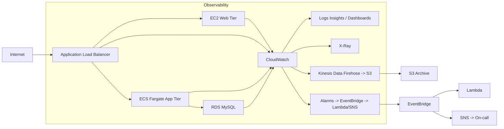

# Architecture Overview

Flows:
- Ingress: Internet → ALB → EC2/ECS
- Observability: Metrics & Logs from EC2/ALB/ECS/RDS flow into CloudWatch. Logs can be exported via Firehose to S3 for archival and analytics.
- Tracing: X-Ray captures distributed traces from ALB → ECS → RDS.
- Automation: CloudWatch alarms emit events to EventBridge which routes to Lambda remediation functions or SNS for notifications.
